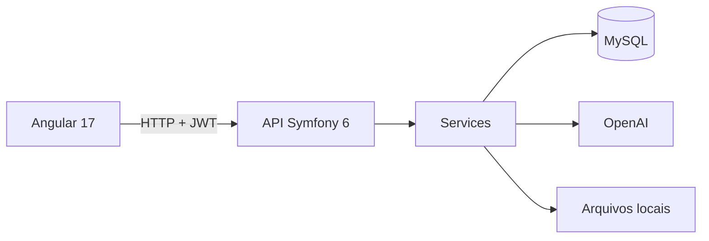

# Visão técnica

## Objetivo

O Smart Tasks AI reúne gestão de tarefas e consulta a uma base de conhecimento privada. Cada usuário pode enviar documentos, importar páginas públicas e fazer perguntas usando somente as fontes que selecionou.

## Arquitetura

- O Angular cuida das telas, formulários e estado das tarefas com NgRx.
- O Symfony separa Controllers, Services, Repositories, DTOs e Entities.
- O Doctrine persiste usuários, tarefas, documentos, chunks e importações.
- A OpenAI é usada para embeddings e geração das respostas.
- JWT protege a API; apenas cadastro e login são públicos.

## Fluxos principais

**Autenticação:** o usuário envia nome e senha, o backend valida as credenciais e devolve um JWT. O frontend guarda o token e o envia nas próximas requisições.

**Documentos:** arquivos PDF ou TXT são validados, têm o texto extraído e dividido em chunks. Cada chunk recebe um embedding antes de ser salvo.

**Web Scraping:** a importação ocorre somente quando solicitada. O sistema aceita páginas públicas, respeita `robots.txt`, segue links do mesmo site quando pedido e bloqueia endereços internos.

**Chat RAG:** a pergunta também vira um embedding. O backend compara esse vetor com os chunks das fontes selecionadas, envia os cinco melhores trechos ao modelo e devolve a resposta com as referências usadas.

## Decisões de IA

- O chat não pesquisa a internet durante a conversa.
- O modelo recebe apenas o contexto recuperado das fontes do usuário.
- Um limiar de similaridade evita respostas baseadas em trechos pouco relacionados.
- Se o contexto não sustentar a resposta, o sistema informa que não encontrou conteúdo suficiente.
- Instruções presentes nos documentos são tratadas como dados, reduzindo o risco de prompt injection.

## Segurança

- Senhas são armazenadas com hash e a API usa autenticação stateless.
- Todas as consultas de tarefas e fontes consideram o usuário autenticado.
- URLs privadas, reservadas ou com credenciais são bloqueadas no scraping.
- Segredos, chaves JWT, certificados e arquivos enviados ficam fora do Git.
- No deploy, a conexão com o MySQL da Aiven usa TLS.

## API em resumo

- `POST /api/register` e `POST /api/login`: autenticação.
- `/api/tasks`: criação, listagem, edição e exclusão de tarefas.
- `/api/documents`: upload, listagem, consulta, reprocessamento e exclusão.
- `/api/sources`: importação, listagem, reprocessamento e exclusão de páginas.
- `DELETE /api/source-imports/{id}`: exclusão de um grupo importado.
- `POST /api/chat`: pergunta sobre as fontes selecionadas.

## Limitações atuais

- A indexação e o scraping são síncronos.
- PDFs digitalizados precisam de OCR, que não foi implementado.
- Os embeddings ficam em JSON no MySQL e a similaridade é calculada na aplicação.
- O histórico do chat existe apenas durante a sessão do navegador.
- As páginas “Bases” e “Configurações” ainda são placeholders.

Os detalhes e critérios de aceite de cada etapa estão em [`docs/specs`](specs/).
